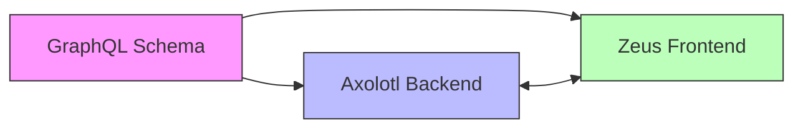

# Axolotl + Zeus

## Full-stack type-safety - po prostu

```mermaid
graph LR
    A[GraphQL Schema] --> B[Axolotl Backend]
    A --> C[Zeus Frontend]
    B <--> C
    style A fill:#f9f,stroke:#333
    style B fill:#bbf,stroke:#333
    style C fill:#bfb,stroke:#333
```
